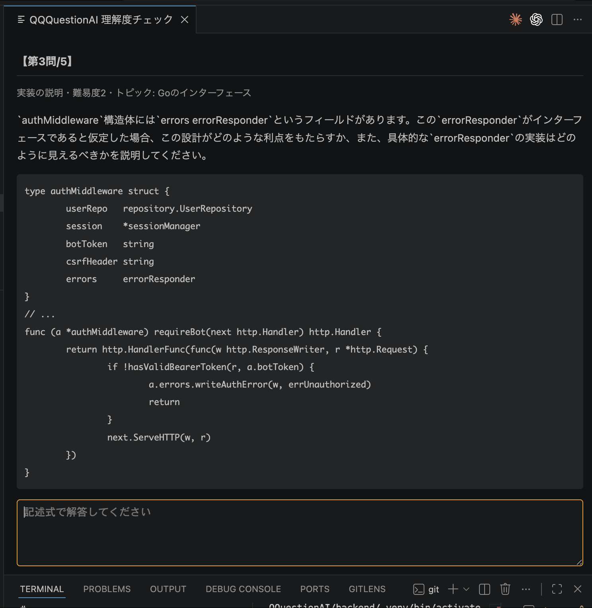

# QQQuestionAI

いま書いたコードの差分から記述式5問を出題し、
「本当に分かって実装しているか」を確認する VSCode 拡張。答えは教えず、段階的なヒントだけを提示する。

**[Visual Studio Marketplace で公開中](https://marketplace.visualstudio.com/items?itemName=Back-Room.qqquestion-ai-v)**（QQQuestionAIVSCode）



## 何をするか

- `quiz` コマンド、または VSCode の「**QQQuestionAI: クイズを開始**」で発動する
- ステージ済みの差分から5問。**1〜2問目は前提知識、3〜5問目は書いたコードそのものに由来する問題**
- 難易度は正答率が高いトピックで上がり、苦手なトピックでは下がる。苦手なトピックは優先的に出題される（過去の解答は保存せず、トピック別の正答率だけを履歴に残す）
- 不正解ならヒント、降参なら解説。**答えは教えない**
- **git の挙動は変えない**。クイズはコミットしないし、結果がコミットを妨げることもない
  （「コミット前に必ず問われる」強制力が欲しい人だけ、任意で pre-commit フックを入れられる）

設計の詳細は [docs/direction.md](docs/direction.md)（要件）と [docs/architecture.md](docs/architecture.md)（実装方針）、
実際の想定対話は [docs/dialogue_examples/](docs/dialogue_examples/) を参照。

## 使う

Marketplace から拡張をインストールし、セットアップ手順は
**[extension/README.md](extension/README.md)** に従うこと（API キーの設定、pre-commit フックの導入まで案内している）。

Gemini の API キーが要る。利用料金は自分の API キーに課金される。
キー無しで動きを見たいだけなら、設定 `qqquestion.fakeLlm` でデモモードが使える。

### 想定用途と、想定していない用途

**コードを書いた本人が、自分の理解度を自分で確かめるための自習用ツール**である。
出題・判定・ヒント・解説はすべて LLM が生成するため、**判定は誤ることがある**。

成績評価・単位認定・採用選考・人事評価など、**人の処遇を決める判断には使わないこと**。
そのように設計されておらず、必要な検証も受けていない（理由は
[extension/README.md](extension/README.md) の同名セクションを参照）。

### 外部に送信されるデータ

問題を作るため、**ステージ済みの差分が Google (Gemini API) に送信される**。
送信は利用者のマシンから利用者自身の API キーで直接行われ、このプロジェクトの運営者は
一切のデータを受け取らない。対話履歴・苦手傾向・ログは利用者のマシン内にのみ保存される。
詳細な一覧は [extension/README.md](extension/README.md) にある。業務で使う場合は勤務先の規程を確認すること。

## 開発

```bash
# バックエンド（Python 3.11+。venv は backend/.venv）
cd backend
python3 -m venv .venv && .venv/bin/pip install -e . fastapi uvicorn pytest httpx
.venv/bin/pip install langchain-core langchain-google-genai chromadb ddgs  # LLM/知識ベース用

.venv/bin/python -m pytest                                  # テスト（LLM/APIキー不要、FakeLLMで動く）
QQQ_FAKE_LLM=1 .venv/bin/python -m qqquestion.cli --demo    # APIキー不要のCLIデモ
GOOGLE_API_KEY=... .venv/bin/python -m qqquestion.server    # 本番サーバ (127.0.0.1:8756)

# VSCode 拡張
cd extension && npm install && npm run compile   # F5 (拡張開発ホスト) で起動
```

コマンドの全量と主要な環境変数は [CLAUDE.md](CLAUDE.md) にある。

利用者のマシンに実際に入るバックエンド依存は [backend/requirements.txt](backend/requirements.txt) に
`==` で固定してあり、更新は Dependabot の PR で行う。**マージしただけでは利用者に届かない**——
拡張の新バージョンを publish して初めて各自の環境が作り直される。

## 構成

- `backend/` — Python バックエンド。`session.py`（出題→判定→ヒント→解説の状態機械）を中心に、
  LLM 呼び出し（`question_gen` / `judge` / `hint_gen` / `explainer`）、差分解析、知識ベース（RAG）、
  苦手傾向の記録、FastAPI サーバ、CLI を持つ
- `extension/` — VSCode 拡張（TypeScript）。バックエンドを自動起動し、Webview でクイズパネルを表示する
- `scripts/hooks/qqquestion-pre-commit` — `QQQ_QUIZ=1` のときだけ発動する pre-commit フック
- `docs/` — 要件・実装方針・想定対話
- `.claude/`・`AGENTS.md` — AIエージェント向けの安全網（下記）
- `.github/` — CI と Dependabot 設定

## 安全網の範囲と限界

このリポジトリは、AIコーディングエージェントとの開発を前提にした安全網を持つ
（[AGENTS.md](AGENTS.md) に全エージェント共通の安全ルール、[CLAUDE.md](CLAUDE.md) に Claude Code 固有の補足）。
これは**事故の確率を下げる仕組みであって、安全を保証する仕組みではない**。
何が守られていて何が守られていないかを理解した上で使うこと。

**守られていること**

- 破壊的なコマンドや、`.env`・秘密鍵などの秘密情報を直接読むコマンド（`cat`・`cp` 等）は、実行前にブロックされる（`permissions.deny` ＋ フラグ後置・ラッパー経由（`bash -c` 等）の変種もトークン解析で検出する `.claude/hooks/deny_dangerous_bash.py`）。ただしglob（`cat .e*`）やプログラム経由（`python3 -c "open('.env')"`）の読み取りまでは追いきれない（下記「守られていないこと」参照）
- 書いたコードは保存・コミットのたびに危険なパターンのチェックを受ける（`security-guidance` プラグイン）
- 壊れたとき・公開するとき・定期点検のときは、専用スキル（`safe-rollback` / `go-live-checklist` / `project-health-check`）が安全な手順に誘導する
- 依存パッケージの更新は Dependabot が追従する（GitHub Actions・`backend/` の pip・`extension/` の npm）

**守られていないこと**

- **チェックはすべて確率的。** LLMによるレビューには見逃しがあり、テストはテストが書かれた範囲しか検査しない。「チェックが通った＝安全」ではない。
- **コマンド検査はブロックリスト方式で、原理的に完全ではない。** シェル経由・ラッパー・`cat`/`cp` での直接読み取りといった代表的な迂回は塞いであるが、シェルの全表現を列挙することはできない。例えばglob展開（`cat .e*`）、プログラム経由の読み取り（`python3 -c "open('.env')"`）、列挙外のコマンド（`setsid` 等）はすり抜けうる。hookは第一関門であり、最後の砦はCI・レビュー・ブランチ保護の層。またhookの動作には `python3` が必要で、入力を解釈できない場合は安全側に倒さず通す（フェイルオープン）設計になっている。
- **CIはテストを実行していない。** 現状の CI（`verify-template`）が検査するのは安全網の整合性だけで、`backend/` の自動テストは手元でしか走らない。「壊れたコードがCIで止まる」状態にはなっていない。
- **公開後の防御は別の層にある。** Marketplace の publisher アカウント（vsce の PAT）が奪われた場合、この拡張は起動時に自動でバックエンドを立ち上げる作りのため影響が大きい。リポジトリ内の仕組みでは守れない。
- **ドメイン固有の判断はできない。** 認証・認可の設計がそのサービスにとって妥当か、個人情報の扱いが法規制に適合しているかは、汎用チェックでは保証できない。
- **リポジトリの外は守れない。** GitHubやクラウドのアカウント自体の防御（2FA等）、APIキーの発行・保管は管轄外。
- **運用は自動化されない。** Dependabotの更新PRやCIの失敗は、誰かが気にかけて初めて意味を持つ。週1回「健康診断して」と依頼すれば `project-health-check` スキルが棚卸しを代行するが、その依頼をする習慣自体は人間側の仕事として残る。

**使うAIツールによる強制力の違い**

この安全網の強制力は、**Claude Codeで使ったときが最大**になるよう作られている。
他のAIコーディングツール（Codex、Cursor等）でこのリポジトリを開いた場合の差を理解しておくこと。

| 層 | Claude Code | Codex / Cursor 等 |
| --- | --- | --- |
| 破壊的コマンド・秘密情報読み取りのブロック | 強制（deny + hook） | **強制されない**（AGENTS.mdの指示ベース＝エージェントが従うことを期待するのみ） |
| コード保存・コミット時のセキュリティレビュー | 強制（プラグイン） | 無し |
| 復旧・公開監査・健康診断の手順 | スキルとして自動発動 | AGENTS.md経由で手順書として参照される（自動発動しない） |
| CI（安全網の整合性検査）・Dependabot | 強制 | **強制**（唯一ツールに依存しない層） |

つまりClaude Code以外では、強制力のある防御はGitHub側だけになる。
他ツールを併用する場合は、CIとブランチ保護を必ず設定すること。

エンジニアでない人がClaude Codeと働くときの約束事は
[docs/working-with-claude-code.md](docs/working-with-claude-code.md) を最初に読むこと。
このリポジトリ専用のスキル一覧は [.claude/skills/README.md](.claude/skills/README.md) にある。

## ライセンス

[MIT](./LICENSE)

このリポジトリは MIT ライセンスのテンプレートリポジトリ（Copyright (c) 2026 Kaito SAKAO）から作られている。
`.claude/skills/`・`AGENTS.md`・`scripts/verify_safety_net.py`・`.github/workflows/verify-template.yml`
などの安全網部分がテンプレート由来で、MIT の条件に従って原著作権表示を [LICENSE](./LICENSE) に残している。
QQQuestionAI 自体（`backend/`・`extension/`）の著作権は QQQuestionAI contributors にある。

配布する VSCode 拡張（.vsix）にはテンプレート由来のコードを同梱していないため、
[extension/LICENSE](./extension/LICENSE) は QQQuestionAI contributors のみを表示している。
